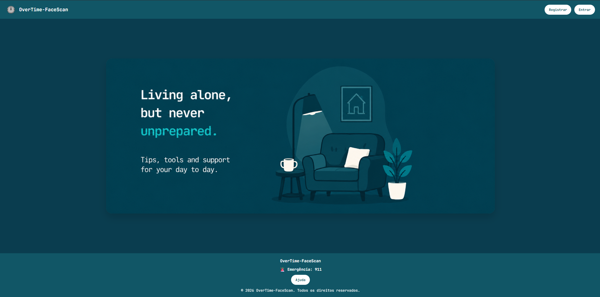
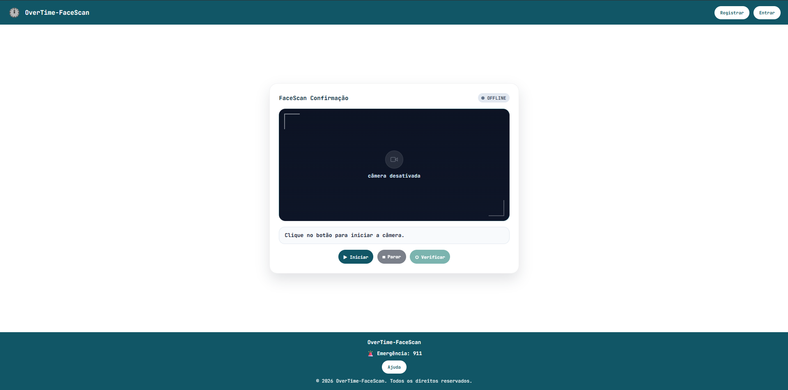
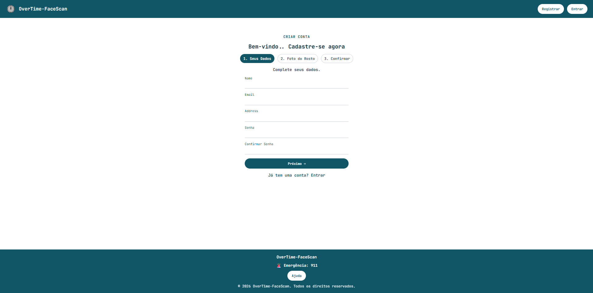
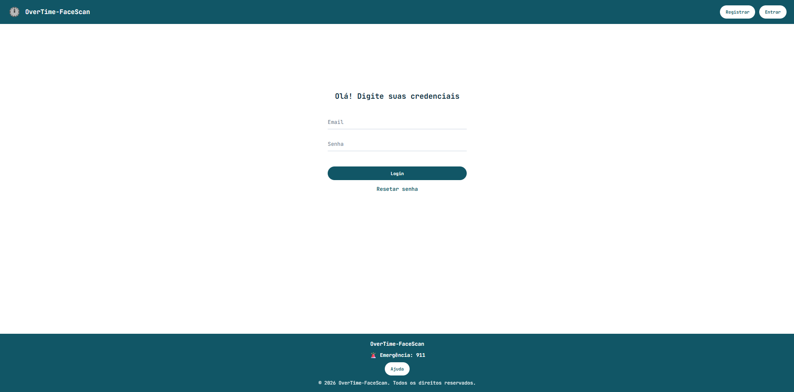
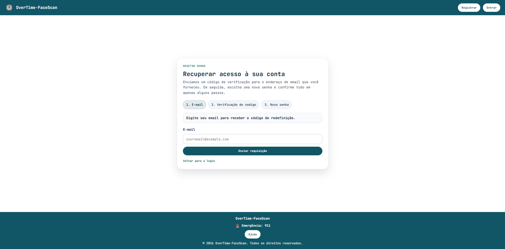
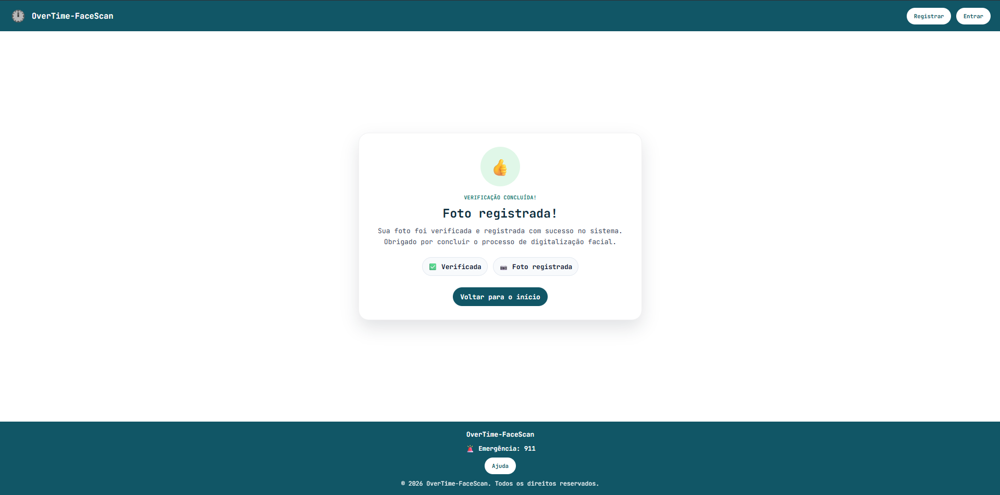

🏠 OverTime-FaceScan

Vivendo sozinho, mas nunca despreparado.

Sistema de check-in diário por reconhecimento facial voltado para pessoas idosas (ou qualquer pessoa) que vivem sozinhas e preferem permanecer em casa em vez de ir para um asilo. Todos os dias, o usuário realiza uma foto ou um vídeo curto para confirmar que está bem. Esse registro fica salvo no sistema e pode ser consultado por familiares, governo ou responsáveis.

📌 Sobre o projeto

Muitas pessoas mais velhas optam por continuar morando em sua própria casa, mesmo sozinhas, em vez de se mudarem para uma instituição de longa permanência. Isso traz autonomia e conforto, mas também preocupação para a família: "será que está tudo bem com ela hoje?"

O OverTime-FaceScan nasce para resolver esse problema de forma simples:

O usuário se cadastra e cria uma conta.
Diariamente, ele acessa o sistema e faz um FaceScan (foto ou vídeo curto) pela própria câmera do dispositivo.
O sistema confirma e registra esse check-in como prova de que a pessoa está bem naquele dia.
Em caso de ausência de registro, o responsavel é alertado. A ideia é que futuramente o sistema possa alertar um contato de emergência (funcionalidade em planejamento — ver Roadmap), 

✨ Funcionalidades atuais

 Landing page de apresentação do propósito do sistema
 Cadastro de usuário em etapas (Dados → Foto do Rosto → Confirmação)
 Login com e-mail e senha
 Recuperação de senha em 3 etapas (E-mail → Código de verificação → Nova senha)
 Tela de FaceScan: captura de foto/vídeo via câmera para o check-in diário
 Tela de confirmação: feedback visual de que o registro foi concluído com sucesso

🖼️ Telas do sistema

Página inicial com a proposta do sistema e botões de Login/Registro na navbar, com o footer um botão de acionar a emergência,
alem de uma auto explicação rapida do contato da emergência(para casos não emergenciais)

Tela onde o usuário liga a câmera, tira a foto ou grava o vídeo do check-in diário

Formulário em etapas para criar a conta (dados pessoais, foto do rosto, confirmação)

Tela de autenticação com e-mail e senha

Fluxo de recuperação de senha via e-mail e código de verificação

Tela exibida após o check-in, confirmando que a foto/vídeo foi validado e salvo

🛠️ Tecnologias utilizadas

Front-end: (ex: HTML, CSS, JavaScript / React / Vue...)
Back-end: (ainda não montado)
Banco de dados: (ex: PostgreSQL)
Reconhecimento/captura facial: (API do navegador getUserMedia, biblioteca de reconhecimento facial, etc.)

🚀 Como rodar o projeto localmente

Ajuste os comandos conforme a stack real do seu projeto.

bash# Clone o repositório
git clone https://github.com/seu-usuario/overtime-facescan.git

# Acesse a pasta do projeto
cd overtime-facescan

# Instale as dependências
npm install

# Rode o projeto
npm start

O projeto deverá abrir em http://localhost (ou na porta configurada).

📂 Estrutura do projeto

Exemplo de estrutura — ajuste para refletir as pastas reais do seu repositório.

overtime-facescan/
├── public/
├── src/
│   ├── pages/
│   │   ├── homepage.jsx
│   │   ├── login.jsx
│   │   ├── register.jsx
│   │   ├── registerconfirmation.jsx
│   │   ├── welcome.jsx
│   │   └── resetpassword.jsx
│   ├── components/
│   └── services/
├── README.md
└── package.json

🗺️ Roadmap

Funcionalidades planejadas para as próximas versões:

 Alerta automático para contato de emergência caso o usuário não faça o check-in no dia
 GPS da localidade do login
 Histórico/calendário de check-ins realizados
 Painel para familiares/cuidadores acompanharem o status do usuário
 Notificações por e-mail ou push lembrando do check-in diário
 Detecção facial real (validar se é a mesma pessoa cadastrada)
 Modo escuro / acessibilidade (fontes maiores, alto contraste) — público-alvo é idoso